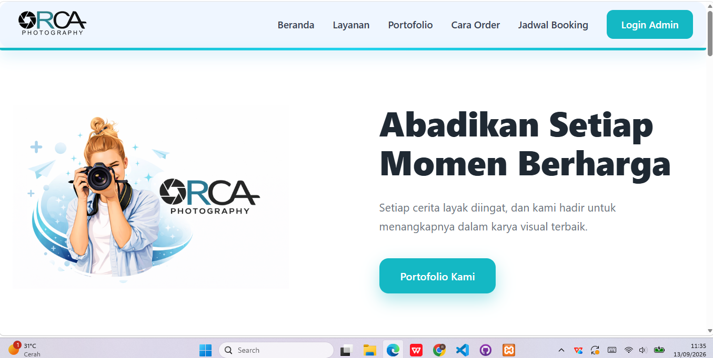
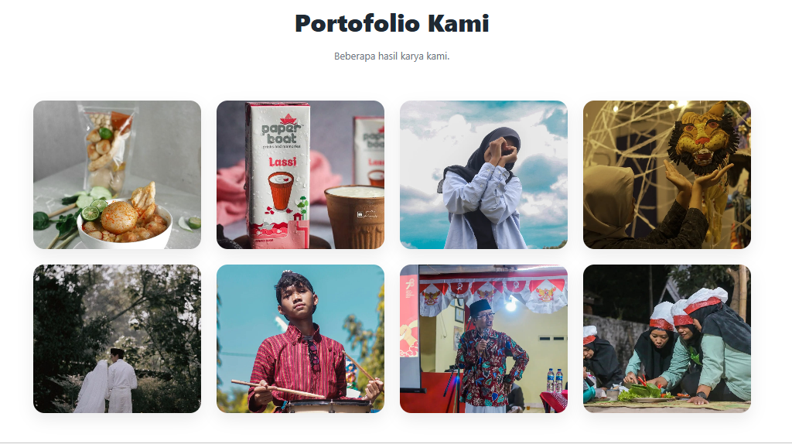
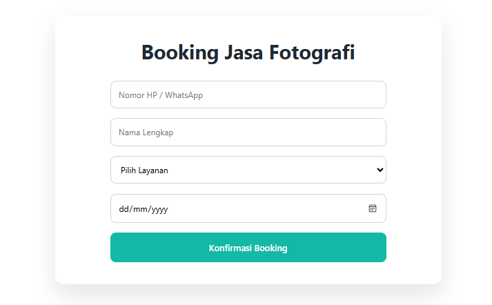
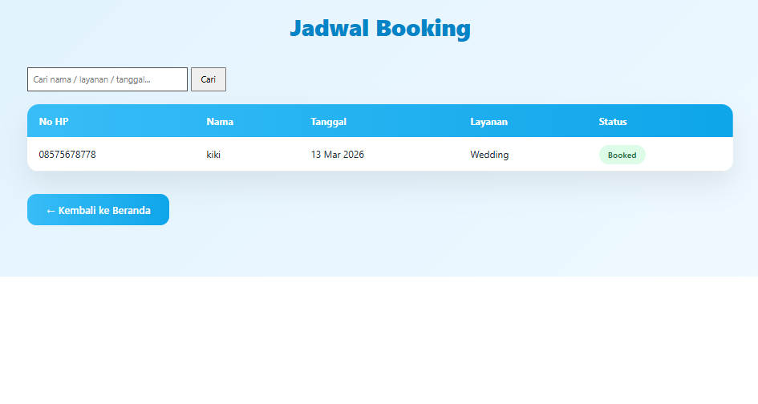

# Orca Photography — Photography & Booking Portal

> A web-based photography and booking portal developed for Orca Photography UMKM.

## Overview

Orca Photography is a web-based platform designed to support the digital presence and booking process of a photography business.

The application provides a public-facing website for visitors to explore photography services and portfolio content, along with an administrative area for managing bookings, services, and portfolio data.

## Key Features

### Public Website
- Photography service information
- Portfolio / gallery showcase
- Booking schedule and date availability
- Online booking form
- WhatsApp contact integration
- Responsive web interface

### Admin Dashboard
- Admin authentication
- Booking management
- Booking status management
- Booking search and deletion
- Service management (CRUD)
- Portfolio management (CRUD)
- Portfolio image upload, replacement, and deletion

## Project Screenshots

### Homepage



### Portfolio



### Booking



### Admin Dashboard



## Technology Stack

| Technology | Usage |
|---|---|
| Laravel 12 | Web application framework |
| PHP 8.2+ | Backend development |
| MySQL | Database |
| Blade | Server-side templating |
| JavaScript | Client-side interaction |
| HTML5 | Website structure |
| CSS3 | Styling and responsive layout |
| Laravel Breeze | Authentication |

## Application Structure

The project follows a Laravel-based MVC architecture.

```text
app/
├── Http/
│   └── Controllers/
│       └── Admin/
├── Models/
│   ├── Booking.php
│   ├── Portfolio.php
│   ├── Service.php
│   └── User.php

database/
├── migrations/
└── seeders/

resources/
└── views/

routes/
└── web.php

public/
└── assets/
